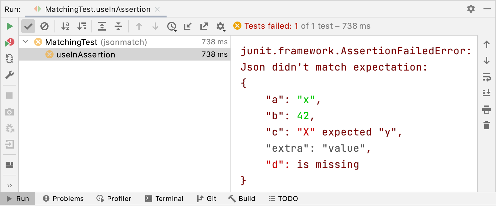

`jsonmatch` is a library that helps with verifying JSON results
in test cases. It provides a DSL to specify expectations,
which is much nicer to use in Java than providing, e.g.
JSON string literals. It also provides a visualisation of
the test result that provides a view of the actual result,
projected through the expectation that has been set up.
Currently the visualisation uses ANSI coloured output.

How to start with Maven:

~~~.xml
<dependency>
    <groupId>berlin.softwaretechnik</groupId>
    <artifactId>jsonmatch</artifactId>
    <version>0.0.6</version>
    <scope>test</scope> <!-- If you only want to use jsonmatch in your tests. -->
</dependency>
~~~
**Note**: This file is generated from the [acceptance test](https://github.com/softwaretechnik-berlin/jsonmatch/blob/main/src/test/java/jsonmatch/MatchingTest.java). To make
changes please edit the acceptance test.

This is how `jsonmatch` can be used in a test:

<pre><code>String result = "{\"a\":\"x\",\"b\":42,\"c\":\"X\",\"extra\":\"value\"}";

assertMatches(result, object()
    .with("a", eq("x"))
    .with("b", eq(42))
    .with("c", eq("y"))
    .with("d", eq("z"))
);</code></pre>

If run in the IDE, the test failure will look like this:

The `assertMatches` method is actually not part of `jsonmatch` (yet).
A possible implementation for JUnit4 could look like this:

<pre><code>void assertMatches(String json, Matcher matcher) {
    Result result = matcher.match(json);
    if (result.isMatch()) {
        return;
    }
    throw new AssertionFailedError("\nJson didn't match expectation:\n" + result.visualize());
}</code></pre>

`jsonmatch` has a couple of static factory methods that serve as the
main interface, that can be imported as follows:

~~~.java
import jsonmatch.JsonMatch.*
~~~

The main concepts in jsonmatch are `Matcher`s that can try to match
`JsonNode`s or `String`s and `Result`s that know whether they
represent a successful match and that can visualize the match (attempt).

More Examples
-------------
Let's look at some more cases. We are using a special
rendering of Java code, that allows us to have inline json literals
and also we have an inline rendering of ANSI-coloured Strings. To take
advantage of the full colouring make sure you look at this file
in [github pages](https://softwaretechnik-berlin.github.io/jsonmatch/).

Matching Simple Objects
-----------------------

The happy path case:

<pre><code>Matcher matcher = object()
    .with("a", eq("x"))
    .with("b", eq("y"))
    .with("z", eq(12))
    .with("d", eq(false))
    .build();

Result result = matcher.match(«{
  "a" : "x",
  "b" : "y",
  "z" : 12,
  "d" : false
}»);

assertEquals(«{
    "a": "x",
    "b": "y",
    "z": 12,
    "d": false
}
», result.visualize());

assertTrue(result.isMatch());</code></pre>

By default the object matcher ignores extra fields.
However it displays the extra information in gray:

<pre><code>Matcher matcher = object()
    .with("a", eq("x"))
    .with("b", eq("y"))
    .build();

Result result = matcher.match(«{
  "a" : "x",
  "b" : "y",
  "z" : 12
}»);

assertEquals(«{
    "a": "x",
    "b": "y",
    "z": 12
}
», result.visualize());

assertTrue(result.isMatch());</code></pre>

We can also choose to elide the values of ignored fields:

<pre><code>Matcher matcher = object()
    .elideIgnoredFieldValues(true)
    .with("a", eq("x"))
    .with("b", eq("y"))
    .build();

Result result = matcher.match(«{
  "a" : "x",
  "b" : "y",
  "z" : 12
}»);

assertEquals(«{
    "a": "x",
    "b": "y",
    "z": …
}
», result.visualize());

assertTrue(result.isMatch());</code></pre>

If the matcher is configured not to ignore extra fields
it will fail as follows:

<pre><code>Matcher matcher = object()
    .ignoreExtraFields(false)
    .with("a", eq("x"))
    .with("b", eq("y"))
    .build();

Result result = matcher.match(«{
  "a" : "x",
  "b" : "y",
  "z" : 12
}»);

assertEquals(«{
    "a": "x",
    "b": "y",
    "z": 12 unexpected field
}
», result.visualize());

assertFalse(result.isMatch());</code></pre>

Obviously field values need to match the expectation:

<pre><code>Matcher matcher = object()
    .with("a", eq("x"))
    .with("b", eq("o"))
    .build();

Result result = matcher.match(«{
  "a" : "x",
  "b" : "y"
}»);

assertFalse(result.isMatch());
assertEquals(«{
    "a": "x",
    "b": "y" expected "o"
}
»,
    result.visualize()
);</code></pre>

Missing fields will also fail to match:

<pre><code>Matcher matcher = object()
    .with("a", eq("x"))
    .with("b", eq("o"))
    .build();

Result result = matcher.match(«{
  "a" : "x"
}»);

assertEquals(«{
    "a": "x",
    "b": is missing
}
»,
    result.visualize()
);

assertFalse(result.isMatch());</code></pre>

Sometimes we want to give context on a particular expection:

<pre><code>Matcher matcher = object()
    .with("a", eq("x"))
    .with("b", annotate(eq(42), "This is the answer, obviously."))
    .build();

Result result = matcher.match(«{
  "a" : "x",
  "b" : 42
}»);

assertEquals(«{
    "a": "x",
    "b": 42 ╶ This is the answer, obviously.
}
»,
    result.visualize()
);

assertTrue(result.isMatch());</code></pre>

Matching Arrays
---------------

We can also match elements of an array.
Currently only an exact match is implemented, however
more match modes, like all `ignoreExtraElements`,
`ignoreOrder` can easily be added. Here a basic
example:

<pre><code>Matcher matcher = array()
    .with(eq("Hello"))
    .with(eq("World"))
    .build();

Result result = matcher.match(«[ "Hello", "World" ]»);

assertTrue(result.isMatch());
assertEquals(«[
    "Hello",
    "World"
]
», result.visualize());</code></pre>

This is what a failed match on an array element looks like:

<pre><code>Matcher matcher = array()
    .with(eq("Hello"))
    .with(eq("World"))
    .build();

Result result = matcher.match(«[ "Hello", "Boat" ]»);

assertFalse(result.isMatch());
assertEquals(«[
    "Hello",
    "Boat" expected "World"
]
», result.visualize());</code></pre>

Nested Objects
--------------

We can also match on nested structures. Actually
matchers support arbitrary nesting:

<pre><code>Matcher matcher = object()
    .with("a", eq("x"))
    .with("b", object()
        .with("c", eq("y"))
        .with("d", eq("z"))
        .build()
    )
    .build();

Result result = matcher.match(«{
  "a" : "x",
  "b" : {
    "c" : "y",
    "d" : "z"
  }
}»);

assertTrue(result.isMatch());

assertEquals(«{
    "a": "x",
    "b": {
        "c": "y",
        "d": "z"
    }
}
», result.visualize()
);</code></pre>

Annotations makes sense especially for bigger longer results.
Here an example where a nested object is annotated.

<pre><code>Matcher matcher = object()
    .with("a", eq("x"))
    .with("b", annotate(
        object()
            .with("c", eq("y"))
            .with("d", eq("z"))
            .build(),
        "This is a nested structure."
    ))
    .build();

Result result = matcher.match(«{
  "a" : "x",
  "b" : {
    "c" : "y",
    "d" : "z"
  }
}»);

assertTrue(result.isMatch());

assertEquals(«{
    "a": "x",
    "b": {        ╮
        "c": "y", ├ This is a nested structure.
        "d": "z"  │
    }             ╯
}
», result.visualize()
);</code></pre>

This is what a mismatch on a nested object looks like:

<pre><code>Matcher matcher = object()
    .with("a", eq("x"))
    .with("b", object()
        .with("c", eq("y"))
        .with("d", eq("z"))
        .build()
    )
    .build();

Result result = matcher.match(«{
  "a" : "x",
  "b" : {
    "c" : "y",
    "d" : "42"
  }
}»);

assertFalse(result.isMatch());

assertEquals(«{
    "a": "x",
    "b": {
        "c": "y",
        "d": "42" expected "z"
    }
}
»,
    result.visualize()
);</code></pre>

We can also match `null`:

<pre><code>Matcher matcher = object()
    .with("a", eq("x"))
    .with("b", isNull())
    .build();

Result result = matcher.match(«{
  "a" : "x",
  "b" : null,
  "z" : null
}»);

assertEquals(«{
    "a": "x",
    "b": null,
    "z": null
}
», result.visualize());

assertTrue(result.isMatch());</code></pre>
